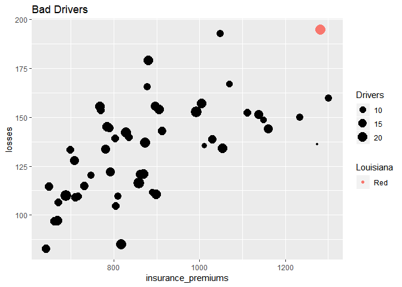

Assignment 3
================

Omar Qasem

For this assignment we are using a dataset from the website [Fivethirtyeight](http://fivethirtyeight.com/). All these datasets are available on their [GitHub page](https://github.com/fivethirtyeight/data/) and in the `fivethirtyeight` package.

1.  Install and load the `fivethirtyeight` library. For this assigment we are using the dataset `bad_drivers`.

``` r
bad_drivers
```

    ## # A tibble: 51 x 8
    ##    state num_drivers perc_speeding perc_alcohol perc_not_distra~
    ##    <chr>       <dbl>         <int>        <int>            <int>
    ##  1 Alab~        18.8            39           30               96
    ##  2 Alas~        18.1            41           25               90
    ##  3 Ariz~        18.6            35           28               84
    ##  4 Arka~        22.4            18           26               94
    ##  5 Cali~        12              35           28               91
    ##  6 Colo~        13.6            37           28               79
    ##  7 Conn~        10.8            46           36               87
    ##  8 Dela~        16.2            38           30               87
    ##  9 Dist~         5.9            34           27              100
    ## 10 Flor~        17.9            21           29               92
    ## # ... with 41 more rows, and 3 more variables: perc_no_previous <int>,
    ## #   insurance_premiums <dbl>, losses <dbl>

1.  In the narrative, add a brief description (`?bad_drivers` for a description of the dataset) using *inline code* to show the variable names. state, num\_drivers, perc\_speeding, perc\_alcohol, perc\_not\_distracted, perc\_no\_previous, insurance\_premiums, losses

2.  Plot a dot chart of premiums by losses. Map the count of drivers to the size of the dots. 

3.  Test what values from `state` are equal to "Louisiana" and assign the output to a new variable called \`Louisiana' (logical)

``` r
#'Louisiana' %in% bad_drivers$state
Louisiana <- bad_drivers %>% 
 # mutate(ouisiana = state)%>%
  filter(bad_drivers$state == 'Louisiana')
```

1.  Map the variable "Louisiana" to `color`. That way, the dot referring to Louisiana should have a different color. 

2.  In your narrative, use inline code to report the average insurance premium and count of losses in US, and the premium and losses in Louisiana. Do not type those values manually, but extract them from the dataset using inline code. The average insurance premium is 886.9576471 and the sum is 6859.15 The average insurance premium is 1281.55 and the sum is 194.78

3.  Report in a tabular format the 5 states with the highest premiums (include only state and insurance\_premiums)

``` r
Sample <- bad_drivers %>%
  arrange(desc(insurance_premiums)) %>%
  select(insurance_premiums, state)
head(Sample, n=5)
```

    ## # A tibble: 5 x 2
    ##   insurance_premiums state               
    ##                <dbl> <chr>               
    ## 1              1302. New Jersey          
    ## 2              1282. Louisiana           
    ## 3              1274. District of Columbia
    ## 4              1234. New York            
    ## 5              1160. Florida

1.  Reshape the dataset gathering together perc\_speeding, perc\_alcohol, perc\_not\_distracted in one variable, paired with their pecentages. Name this variable "ViolationType" and the variable for the value pairs "perc".

``` r
gather(bad_drivers, key = 'ViolationType', value = 'perc', perc_alcohol, perc_speeding, perc_not_distracted)
```

    ## # A tibble: 153 x 7
    ##    state num_drivers perc_no_previous insurance_premi~ losses ViolationType
    ##    <chr>       <dbl>            <int>            <dbl>  <dbl> <chr>        
    ##  1 Alab~        18.8               80             785.   145. perc_alcohol 
    ##  2 Alas~        18.1               94            1053.   134. perc_alcohol 
    ##  3 Ariz~        18.6               96             899.   110. perc_alcohol 
    ##  4 Arka~        22.4               95             827.   142. perc_alcohol 
    ##  5 Cali~        12                 89             878.   166. perc_alcohol 
    ##  6 Colo~        13.6               95             836.   140. perc_alcohol 
    ##  7 Conn~        10.8               82            1069.   167. perc_alcohol 
    ##  8 Dela~        16.2               99            1138.   151. perc_alcohol 
    ##  9 Dist~         5.9              100            1274.   136. perc_alcohol 
    ## 10 Flor~        17.9               94            1160.   144. perc_alcohol 
    ## # ... with 143 more rows, and 1 more variable: perc <int>

1.  Use facetting (DO NOT use 3 distinct calls to `ggplot()`) to plot 3 dot plots for the correlation between:

-   insurance\_premiums and perc\_alcohol
-   insurance\_premiums and perc\_speeding
-   insurance\_premiums and perc\_not\_distracted

``` r
gather(bad_drivers, key = 'ViolationType', value = 'perc', perc_speeding, perc_alcohol, perc_not_distracted) %>%
 ggplot() +
  geom_point(aes(x= insurance_premiums, y = perc)) +
    facet_wrap(~ViolationType)
```


1.  Mute the code for both charts and add a title to both. Knit to html.
