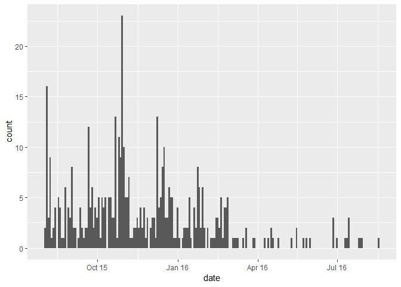
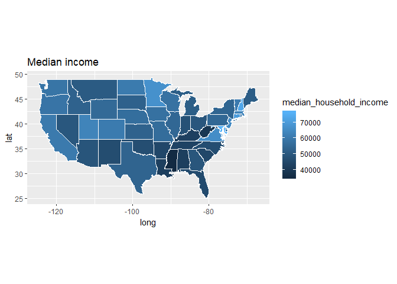
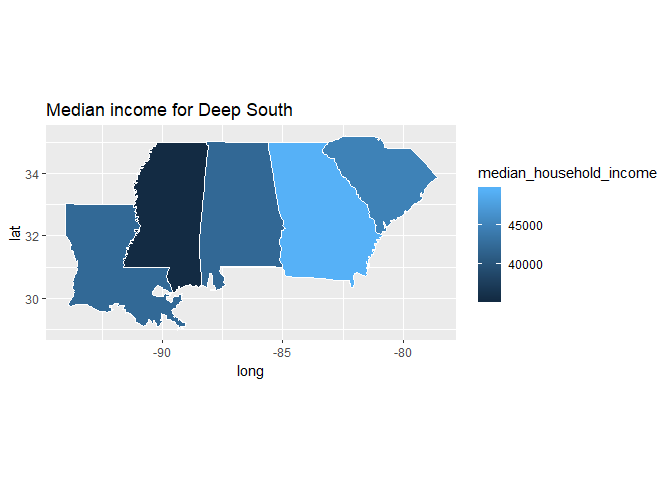

Assignment 4
================

Omar Qasem
==========

Trump's Tweets
==============

Read the below dataset on from <https://github.com/fivethirtyeight/data/tree/master/trump-twitter>. Then use the appropriate function from the package `lubridate` to convert `created_at` into a date.

Use `geom_histogram` to plot a histogram of tweets count. Change the x-axis title into 'date' and the x-axis labels into a `mon 'yy` format (e.g., `Dec '15`).

Note that there is a difference between time and datetime: If you coerce `created_at` to a datetime (which keeps information about the time too), you will need `scale_x_datetime` instead of `scale_x_date`

``` r
library(tidyverse)
library(lubridate)
library(maps)
library(ggplot2)
dt <- read_csv('https://raw.githubusercontent.com/fivethirtyeight/data/master/trump-twitter/realDonaldTrump_poll_tweets.csv') %>%
  mutate(created_at = mdy_hms(created_at))

date <- dt$created_at

ggplot(dt, aes(x = date)) + scale_x_datetime(date_labels = "%b %y") +
  geom_histogram(bins = 200)
```



Income map
==========

Use the below dataset to plot a choropleth map of incomes by state. Map `median_household_income` to the state fill. For a shapefile of the US states use `map_data("state")`. Adjust the legend setting the title to "Median income" and formatting the scale as `$xx,xxx`.

``` r
dt <- read_csv('https://raw.githubusercontent.com/fivethirtyeight/data/master/hate-crimes/hate_crimes.csv')
states <- map_data("state")

dt <- mutate(dt,state = tolower(state))
MedianIncome<- select(dt, state,median_household_income )

states<- right_join(states, MedianIncome, by= c( 'region'='state'))

ggplot(data = states) +

 geom_polygon(aes(x = long, y = lat, group = group, fill = median_household_income ), color = "white") + coord_fixed(1.3)+ labs(title = 'Median income')->MHImap

MHImap
```



Repeat the above for the Deep South only (Louisiana, Alabama, Mississippi, Georgia, South Carolina). Add a title.

``` r
dt <- read_csv('https://raw.githubusercontent.com/fivethirtyeight/data/master/hate-crimes/hate_crimes.csv')

dt <- dt %>% 
  filter(state == "Louisiana" | state == "Alabama" | state ==  "Mississippi" | state ==  "Georgia" |state ==  "South Carolina")

states <- map_data("state")

dt <- mutate(dt,state = tolower(state))
MedianIncome<- select(dt, state,median_household_income )

states<- right_join(states, MedianIncome, by= c( 'region'='state'))

ggplot(data = states) +

 geom_polygon(aes(x = long, y = lat, group = group, fill = median_household_income ), color = "white") + coord_fixed(1.3)+ labs(title = 'Median income for Deep South')->MHImap

MHImap
```



Use inline code to output the median income (appropriately formatted) and the Gini-Index for Louisiana.

``` r
dt <- read_csv('https://raw.githubusercontent.com/fivethirtyeight/data/master/hate-crimes/hate_crimes.csv')
dt <- filter(dt, state == "Louisiana")
```

the median income for louisiana is 42406 and the Gini-Index for Louisiana is 0.475
