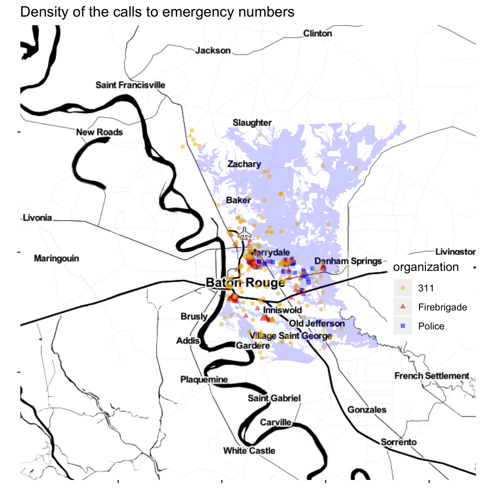

# Assignment 5

Produce a map of the locations for the emergency calls during the Lousiana Flood, 2016 in the East Baton Rouge area. The output should look similar to the below: 

Feel free to choose the style of the map (e.g., satellite, watercolor), the color-pallette, and other aesthetical attributes, but your map should at least show:

- the locations for calls to 311 calls for "DRAINAGE, EROSION, FLOODING OR HOLES"
- the locations for calls to firebrigade for "SEVERE WEATHER OR NATURAL DISASTER, OTHER" or "WATER EVACUATION"  
- the locations for calls to 911 for "LOOTING"

As a timespan, use calls between '2016-08-12' and '2016-08-22'.

Refer to the notes from `lesson11_openData/BRflood2016.R` for how to use the Socrata API to extract the emergency calls data from [BR OpenData](https://data.brla.gov/).
 
 
 brMap <- readRDS(here::here('data/mapTerrainBR.RDS'))ggmap::ggmap(brMap) +
 geom_point(data = filter(dt_311, parenttype == "DRAINAGE, EROSION, FLOODING OR HOLES"),
            aes(x = long, y = lat), color = 'darkred', alpha = .33) +
 geom_point(data = filter(dt_fire, inci_descript == "Severe weather or natural disaster, Other" | inci_descript == "Water evacuation"),
            aes(x = long, y = lat), color = 'yellow', alpha = .33) +
 geom_point(data = filter(dt_911, offense_desc == "LOOTING"),
            aes(x = long, y = lat), color = 'blue', alpha = .33) +
            ggtitle('Emergency Calls')
            
dt_fire <- dt_fire %>% 
  filter(geolocation != "") %>%
  mutate(geolocation = str_extract_all(geolocation, '[-,.,0-9]+')) %>% 
  mutate(long = as.double(map_chr(geolocation, 1)), lat = as.double(map_chr(geolocation, 2)))
  
  dt_911 <- dt_911 %>% 
  filter(geolocation != "") %>%
  mutate(geolocation = str_extract_all(geolocation, '[-,.,0-9]+')) %>% 
  mutate(long = as.double(map_chr(geolocation, 1)), lat = as.double(map_chr(geolocation, 2)))
